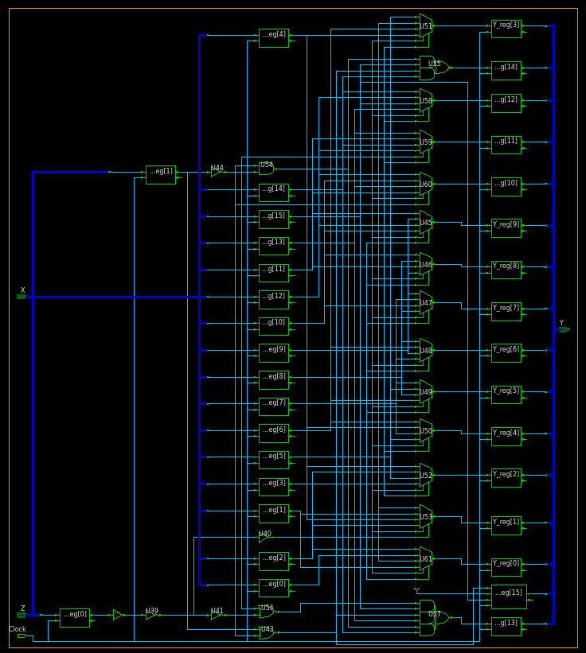
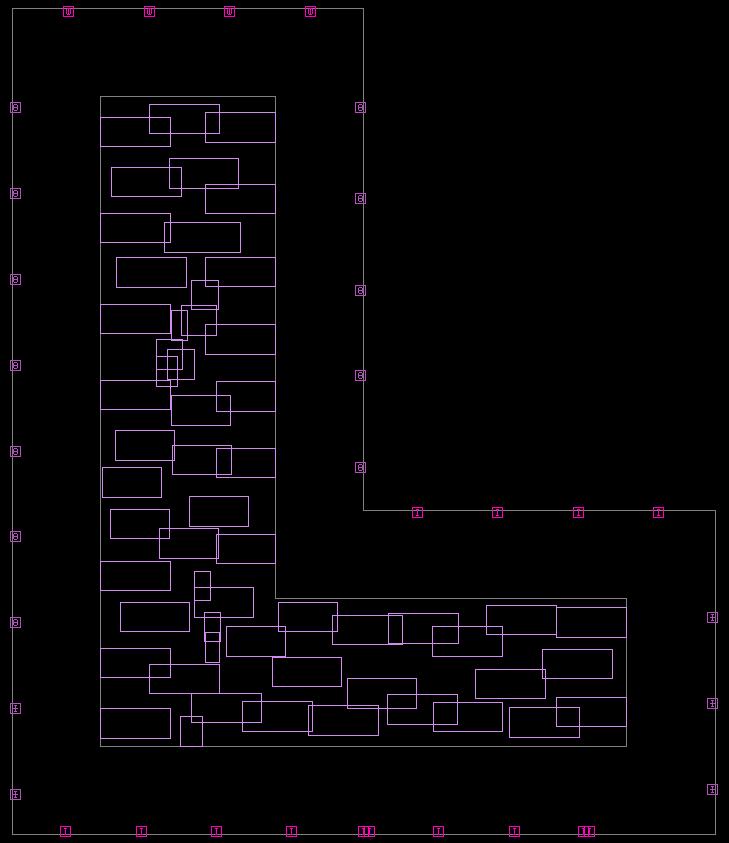
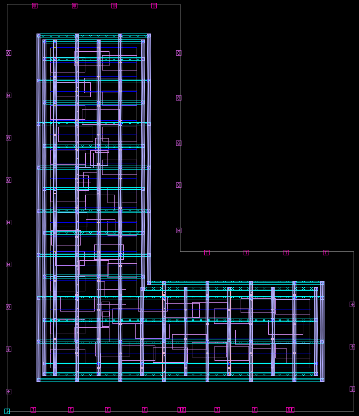
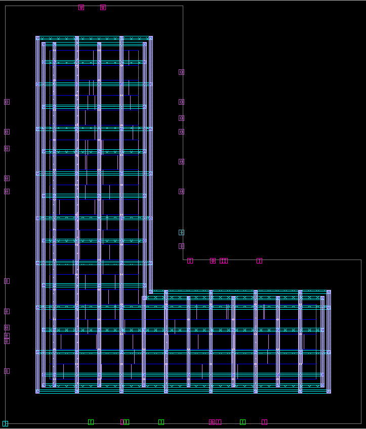
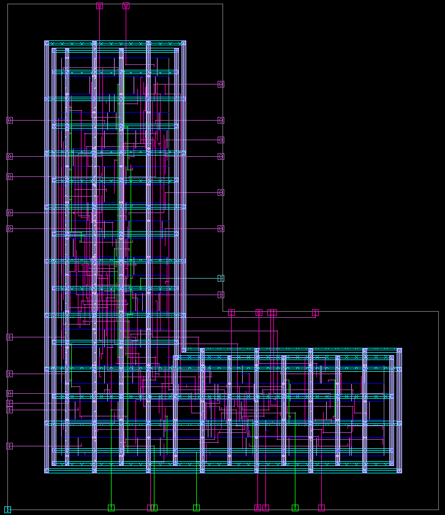
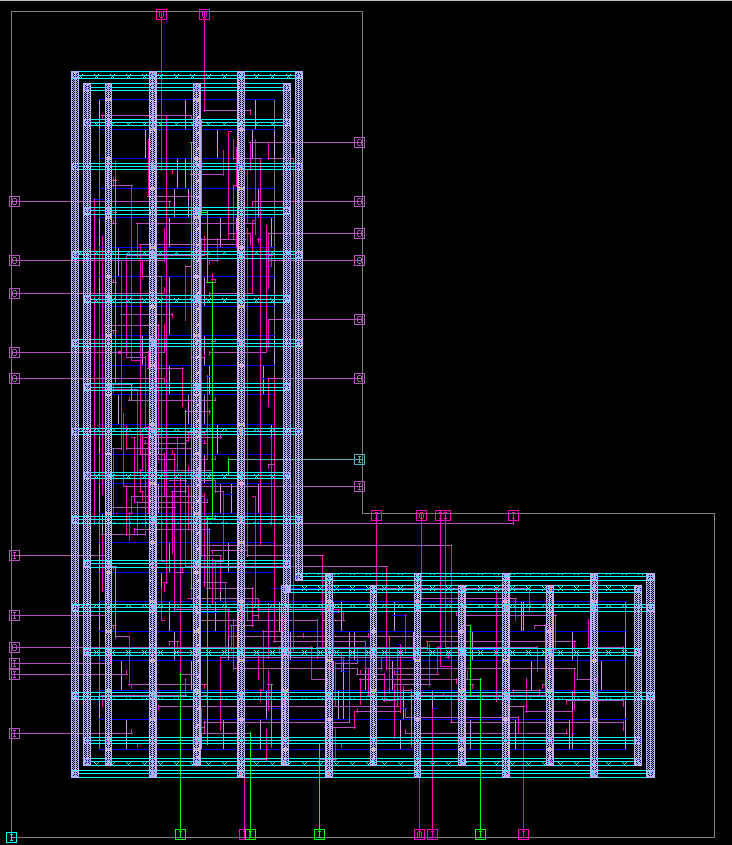

# 🚀 Power-of-2 Divider (RTL to GDSII Flow)

This project implements a **Power-of-2 Divider (Y = X / 2^Z)** and demonstrates its complete journey through the **RTL to GDSII ASIC design flow**.

It was developed as part of a **hands-on VLSI workshop**, showcasing practical understanding of **digital design, synthesis, and physical implementation**.

---

## 📌 Overview

The design performs division by powers of 2 using **efficient bit-shifting**, making it highly optimized for hardware implementation.

Instead of using complex division algorithms, the operation is simplified as:

    Y = X >> Z

This significantly reduces hardware complexity, area, and delay.

---

## 🛠️ Design Flow

This project covers the **complete RTL to GDSII flow**, which is the standard pipeline for ASIC design:

1. **RTL Design (Verilog)**
2. **Functional Verification (Testbench)**
3. **Synthesis (RTL → Gate-level Netlist)**
4. **Static Timing Analysis (STA)**
5. **Floorplanning**
6. **Placement**
7. **Clock Tree Synthesis (CTS)**
8. **Routing**
9. **GDSII Generation**

---

## 🧰 Tools & Technologies

* **Verilog HDL** – RTL design
* **VCS & Verdi** – Simulation / Verification
* **Synopsys Design Compiler** – Synthesis
* **IC Compiler II (ICC2)** – Physical Design
* **PrimeTime** – Static Timing Analysis
* **Linux + TCL scripting** – Automation

*(Tools may vary depending on setup/workshop environment)*

---

## 📂 Repository Structure

```
├── RTL/                # Verilog RTL design files
├── RTL_SIMULATION/     # TB file for simulation
├── DC/                 # Design Compiler (netlist generation)
├── ICCII/              # Physical design
├── PT/                 # STA
├── constraints/        # constraint file
├── ref/                # Standard cell libraries
├── clean               # Bash script to remove clean setup
└── README.md
```

---

## ⚙️ How It Works

* The divider uses **bitwise right shift** to perform division.
* Each shift corresponds to division by 2:

  * `X >> 1` → X / 2
  * `X >> 2` → X / 4
  * `X >> Z` → X / (2^Z)

This makes it:

* ⚡ Fast (no iterative division)
* 🧠 Simple logic
* 📉 Low area and power

---

## 📊 Results (Example)

* ✅ Functional verification passed
* ✅ Timing constraints met (positive slack)
* ✅ Successfully synthesized and placed & routed
* ✅ GDSII generated

---

## 📸 Flow Visualization

RTL → Synthesis → Floorplan → Placement → Routing → GDSII

### Schematic



### Floorplan



### Powerplan



### Placement



### Clock tree synthesis



### Routing



---

## 🎯 Key Learnings

* End-to-end **ASIC design flow understanding**
* Importance of **timing closure and constraints**
* Trade-offs between **area, power, and performance**
* Hands-on experience with **industry EDA tools**

---

## 📌 Future Improvements

* Add pipelining for higher performance
* Support variable bit-width configurations
* Power optimization techniques
* DFT (Design for Testability) integration

---

## ⭐ If you found this useful, consider giving it a star!